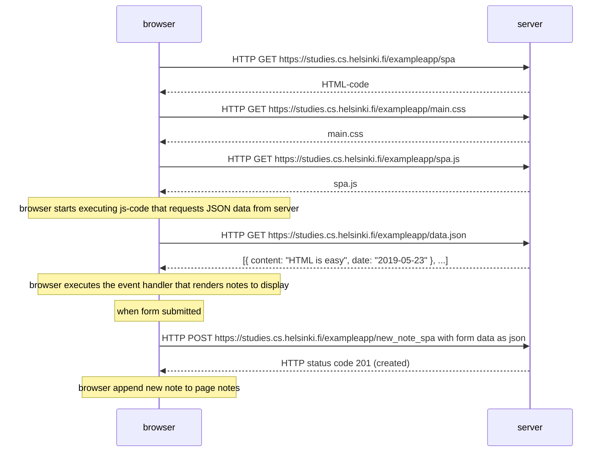

```mermaid
sequenceDiagram

browser->>server: HTTP GET https://studies.cs.helsinki.fi/exampleapp/spa
server-->>browser: HTML-code
browser->>server: HTTP GET https://studies.cs.helsinki.fi/exampleapp/main.css
server-->>browser: main.css
browser->>server: HTTP GET https://studies.cs.helsinki.fi/exampleapp/spa.js
server-->>browser: spa.js

note over browser: browser starts executing js-code that requests JSON data from server

browser->>server: HTTP GET https://studies.cs.helsinki.fi/exampleapp/data.json
server-->>browser: [{ content: "HTML is easy", date: "2019-05-23" }, ...]

note over browser: browser executes the event handler that renders notes to display

note over browser: when form submitted

browser->>server: HTTP POST https://studies.cs.helsinki.fi/exampleapp/new_note_spa with form data as json
server-->>browser: HTTP status code 201 (created)

note over browser: browser append new note to page notes
```
